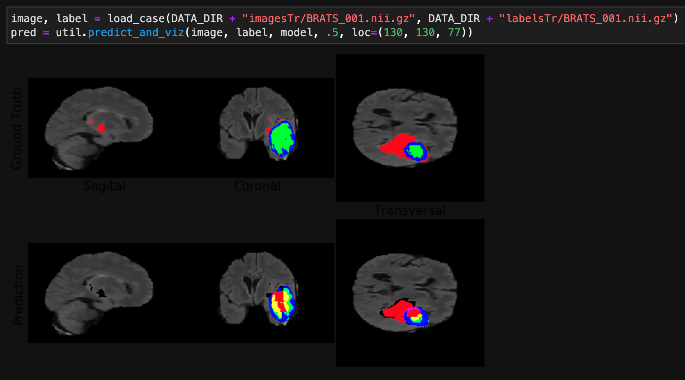

# Brain Tumor Auto Segmentation for Magnetic Resonance Imaging
This project uses the U-Net CNN to ingest 4-dimensional magnetic resonance imaging (MRI) images in the form of standardized arrays and automatically segment tumorous regions of the brain by classifying each voxel as either background, edema, non-enhancing tumor, or enhancing tumor. The loss function used is the multi-class soft dice loss, an analogue of the dice similarity coefficient which is more suitable for the probabalistic output of our model (each voxel is assigned a probability between 0 and 1 for each of the aforementioned classes).

 
*NOTE THAT THIS PROJECT WAS BUILT USING A NOW-DEPRECATED VERSION OF TENSORFLOW/KERAS*
A re-implementation is currently in the works! :)